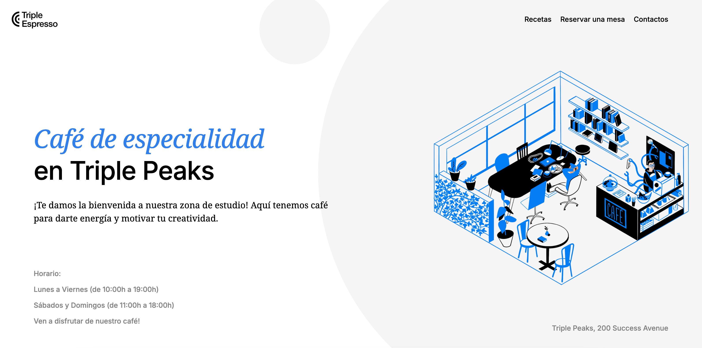
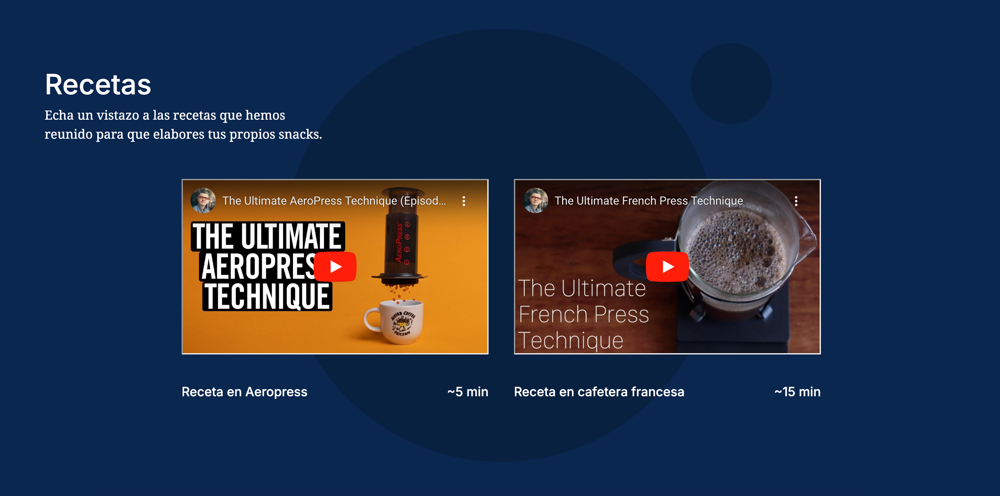
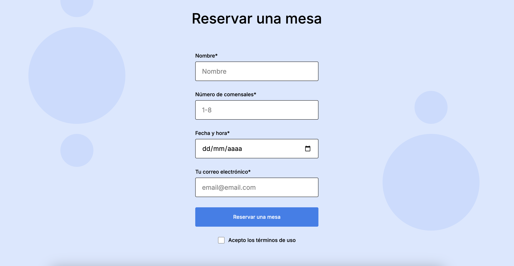
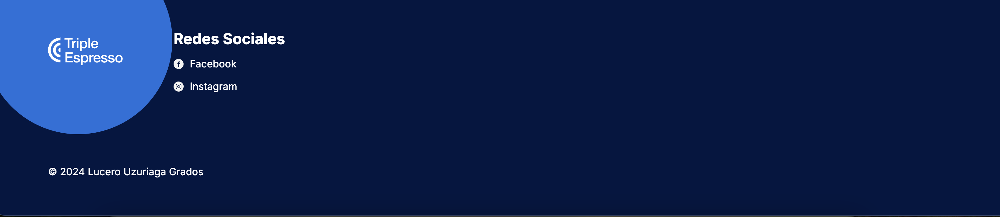

# Triple Expresso - Cafetería y Tienda Digital de Café

Bienvenido a **Triple Expresso**, tu cafetería en línea donde puedes descubrir recetas de café, reservar una mesa y conectarte con nosotros a través de las redes sociales.

## Descripción del Proyecto

Este proyecto es una representación digital de una cafetería y tienda de café llamada **Triple Expresso**. Incluye una página de inicio con secciones dedicadas a recetas de café, un formulario para reservar una mesa, y enlaces a nuestras redes sociales.

## Estructura del Proyecto

El proyecto está organizado de la siguiente manera:







```plaintext
web_project_coffeeshop/
  ├── images/                      <- todas las imágenes
  ├── pages/
  │   └── index.css                <- estilos CSS de la página principal
  ├── blocks/                      <- archivos CSS específicos de bloques
  │   ├── footer.css
  │   ├── form.css
  │   ├── header.css
  │   ├── nav.css
  │   ├── page.css
  │   ├── recipes.css
  │   └── reservation.css
  ├── vendor/                      <- normalize.css
  ├── favicon.ico
  ├── index.html                   <- archivo HTML principal
  ├── README.md                    <- este archivo
  ├── .editorconfig                <- configuración de editor
  └── .gitignore                   <- archivos a ignorar en git

  Características

	•	Página de Inicio: Presenta la cafetería, muestra recetas de café en video, y ofrece información sobre cómo reservar una mesa.
	•	Formulario de Reserva: Permite a los usuarios reservar una mesa seleccionando la fecha, hora y número de comensales.
	•	BEM (Block Element Modifier): La estructura del proyecto sigue la metodología BEM para una mejor organización y mantenimiento del código CSS.
	•	Responsive Design: La página está optimizada para verse bien en diferentes dispositivos.

Tecnologías Utilizadas

	•	HTML5: Para la estructura del sitio.
	•	CSS3: Para el estilo y diseño visual, incluyendo el uso de BEM.
	•	Normalize.css: Para la normalización de estilos entre navegadores.
	•	Google Fonts: Se utilizan las fuentes Inter y Noto Serif.

Aprendizajes

Durante este proyecto, aprendí a:

	•	Crear formularios HTML accesibles y funcionales.
	•	Insertar videos dentro de la pagina.
  •	Utilizar la metodología BEM para estructurar y organizar mi código CSS de manera efectiva.

Enlaces

	- [Repositorio en GitHub](https://github.com/luuzuriaga/web_project_coffeeshop)

Autor

Lucero Uzuriaga Grados - GitHub

© 2024 Lucero Uzuriaga Grados


