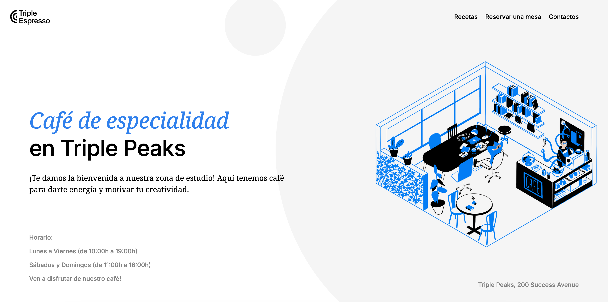
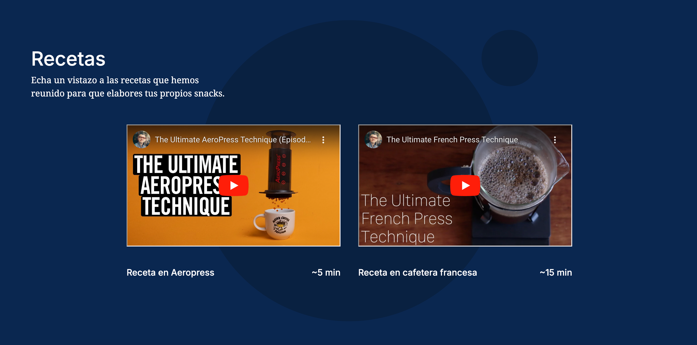
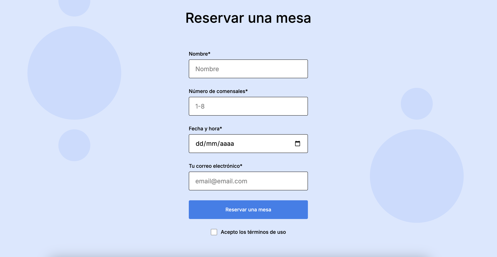
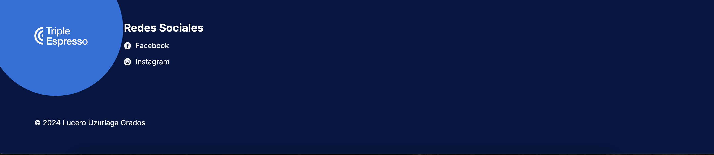

# ☕ Triple Expresso - Cafetería y Tienda Digital de Café

Bienvenido a **Triple Expresso**, tu cafetería en línea donde puedes descubrir recetas de café, reservar una mesa y conectarte con nosotros a través de las redes sociales.

## 📋 Descripción del Proyecto

**Triple Expresso** es una representación digital moderna de una cafetería y tienda de café. Este proyecto web incluye una página de inicio intuitiva con secciones dedicadas a recetas de café, un sistema de reservas en línea y enlaces directos a nuestras redes sociales para mantenerte conectado con nuestra comunidad cafetera.

## 🖼️ Vista Previa






## 📁 Estructura del Proyecto
```plaintext
web_project_coffeeshop/
├── images/                      # Recursos visuales e imágenes
├── pages/
│   └── index.css               # Estilos CSS de la página principal
├── blocks/                     # Archivos CSS específicos por componente
│   ├── footer.css
│   ├── form.css
│   ├── header.css
│   ├── nav.css
│   ├── page.css
│   ├── recipes.css
│   └── reservation.css
├── vendor/
│   └── normalize.css           # Normalización de estilos entre navegadores
├── favicon.ico                 # Ícono del sitio
├── index.html                  # Archivo HTML principal
├── README.md                   # Documentación del proyecto
├── .editorconfig              # Configuración del editor
└── .gitignore                 # Archivos excluidos del control de versiones
```

## ✨ Características

- **Página de Inicio Atractiva**: Presenta la cafetería con un diseño moderno y acogedor
- **Galería de Recetas**: Muestra recetas de café en formato video para inspirar a los amantes del café
- **Sistema de Reservas**: Formulario interactivo que permite a los usuarios reservar mesa seleccionando fecha, hora y número de comensales
- **Metodología BEM**: Implementación de la arquitectura BEM (Block Element Modifier) para un código CSS limpio y mantenible
- **Diseño Responsive**: Interfaz completamente adaptable a dispositivos móviles, tablets y escritorio
- **Integración de Redes Sociales**: Enlaces directos para conectar con la comunidad de Triple Expresso

## 🛠️ Tecnologías Utilizadas


- **HTML5**: Estructura semántica del sitio web
- **CSS3**: Estilización avanzada con uso de flexbox, grid y metodología BEM
- **Normalize.css**: Normalización de estilos cross-browser
- **Google Fonts**: Tipografías Inter y Noto Serif para una experiencia visual óptima

## 📚 Aprendizajes

Durante el desarrollo de este proyecto, adquirí experiencia en:

- Creación de **formularios HTML accesibles y funcionales** siguiendo las mejores prácticas de UX
- Implementación de **videos embebidos** dentro de la página para contenido multimedia
- Aplicación de la **metodología BEM** para estructurar y organizar el código CSS de manera escalable y mantenible
- Diseño **responsive** adaptado a múltiples dispositivos y resoluciones
- Organización de archivos CSS en **bloques modulares** para facilitar el mantenimiento

## 🔗 Enlaces

- **Repositorio en GitHub**: [web_project_coffeeshop](https://github.com/luuzuriaga/web_project_coffeeshop)
- **Demo en vivo**: [Próximamente]

## 👩‍💻 Autor

**Lucero Uzuriaga Grados**  
[GitHub](https://github.com/luuzuriaga)

---

© 2024 Lucero Uzuriaga Grados. Todos los derechos reservados.
